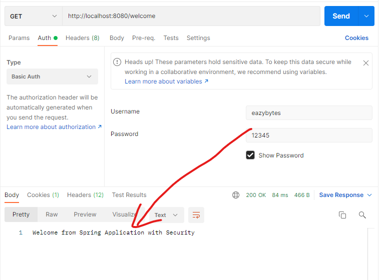
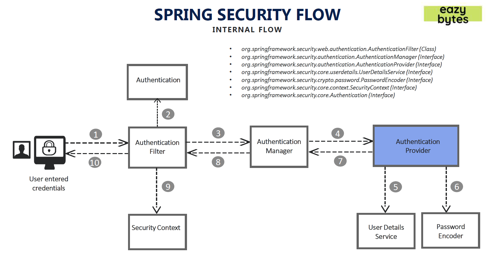
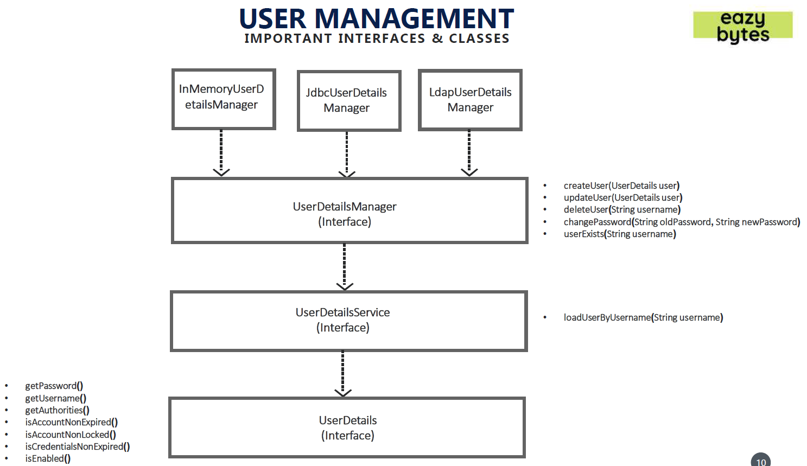

# learn-spring-security
<!-- TOC -->

- [learn-spring-security](#learn-spring-security)
    - [resource](#resource)
    - [section 1: spring security basics](#section-1-spring-security-basics)
        - [default account](#default-account)
        - [multiple requests without crediential by spring-security](#multiple-requests-without-crediential-by-spring-security)
        - [spring securith flow](#spring-securith-flow)
    - [section 2: changing the default security configurations](#section-2-changing-the-default-security-configurations)
        - [configure API access](#configure-api-access)
    - [section 3: Defining & Managing Users](#section-3-defining--managing-users)
        - [configure users accounts + authorization rules](#configure-users-accounts--authorization-rules)
        - [important User Management related classes](#important-user-management-related-classes)
        - [Implement customized UserDetailsService](#implement-customized-userdetailsservice)
    - [section 4: Password Management with PasswordEncoders](#section-4-password-management-with-passwordencoders)
        - [PasswordEncoder](#passwordencoder)
    - [section 5: Understanding Authentication Provider and Implementing it](#section-5-understanding-authentication-provider-and-implementing-it)

<!-- /TOC -->
## resource
- [udemy course](https://www.udemy.com/course/spring-security-zero-to-master/)
    - [GitHub material](https://github.com/eazybytes/spring-security)
    - [slides](./docs/Spring+Security+Zero+to+Master+along+with+JWT,OAUTH2.pdf)

## section 1: spring security basics
In pom.xml
```xml
<dependencies>
    <dependency>
        <groupId>org.springframework.boot</groupId>
        <artifactId>spring-boot-starter-security</artifactId> <!--> enables soring security, i.e.: prompt /login if accessing unauthorized page <-->
    </dependency>
    ...
</dependencies>
```

### default account
[link](./spring-security-code/section1/springsecuritybasic/src/main/resources/application.properties)

### multiple requests without crediential by spring-security
- without auth:  
    -   
- with auth:  
    - 
- multiple times enabled by value stored in cookie
    - 


### spring securith flow
- 
1. AuthenticationFilter: 
    - A filter that intercepts and performs authentication of a particular request by delegating it to the authentication manager If authentication is successful, the authentication details is set into SecurityContext
2. Authentication: 
    - Using the supplied values from the user like username and password, the authentication object will be formed which will be given as an input to the AuthenticationManager interface
3. AuthenticationManager: 
    - Once received request from filter it delegates the validating of the user details to the authentication provider
4. AuthenticationProvider **<u>(business logic)</u>**: 
    - It has all the logic of validating user details using UserDetailsService and PasswordEncoder
5. UserDetailsService: 
    - UserDetailsService retrieves UserDetails and implements the User interface using the supplied username
6. PasswordEncoder: 
    - Service interface for encoding passwords
7. SecurityContext: 
    - Interface defining the minimum security information associated with the current thread of execution It holds the authentication data post successful authentication **<u>(stores the details of the currently authenticated user inside Spring Security framework)</u>**

## section 2: changing the default security configurations
- Services with out any security
    - /contact
        - This service should accept the details from the Contact Us page in the UI and save to the DB.
    - /notices
        - This service should send the notice details from the DB to the ‘NOTICES’ page in the UI
- Services with security
    - /myAccount
        - This service should send the account details of the logged in user from the DB to the UI
    - /myBalance
        - This service should send the balance and transaction details of the logged in user from the DB to the UI
    - /myLoans
        - This service should send the loan details of the logged in user from the DB to the UI
    - /myCards
        - This service should send the card details of the logged in user from the DB to the UI
### configure API access
- default behavior:
    - authenticate all methods for all users
- configure above security permission: [ProjectSecurityConfig.java](./spring-security-code\section2\springsecsection2\src\main\java\com\eazybytes\config\ProjectSecurityConfig.java)
    ```java
    /**
     * Custom configurations as per our requirement
     */
    http
        .authorizeRequests()
            .antMatchers("/myAccount").authenticated()
            .antMatchers("/myBalance").authenticated()
            .antMatchers("/myLoans").authenticated()
            .antMatchers("/myCards").authenticated()
            .antMatchers("/notices").permitAll()
            .antMatchers("/contact").permitAll()
            .and()
        .formLogin().and()
        .httpBasic();
    ```

## section 3: Defining & Managing Users
### configure users accounts + authorization rules
- 所有信息都存在内存里

- `inMemoryAuthentication()`
    - ```java
      @Configuration
      public class ProjectSecurityConfig extends WebSecurityConfigurerAdapter {
          @Override
          protected void configure(AuthenticationManagerBuilder auth) throws Exception {
              auth.inMemoryAuthentication()
                      .withUser("admin").password("12345").authorities("admin").and()
                      .withUser("user").password("12345").authorities("read").and()
                      .passwordEncoder(NoOpPasswordEncoder.getInstance());
          }
      }
      ```
    
- `InMemoryUserDetailsManager`
    - ```java
      @Configuration
      public class ProjectSecurityConfig extends WebSecurityConfigurerAdapter {
          @Override
          protected void configure(AuthenticationManagerBuilder auth) throws Exception {
              InMemoryUserDetailsManager userDetailsService = new InMemoryUserDetailsManager();
              UserDetails user  = User.withUsername("admin").password("12345").authorities("admin").build();
              UserDetails user1 = User.withUsername("user" ).password("12345").authorities("read" ).build();
              userDetailsService.createUser(user);
              userDetailsService.createUser(user1);
              auth.userDetailsService(userDetailsService);
          }
          // As we do not have a PasswordEncoder as above has, we need to configure it here for       InMemoryUserDetailsManager
          @Bean
          public PasswordEncoder passwordEncoder() {
              return NoOpPasswordEncoder.getInstance();
          }
      }
      ```

### important User Management related classes
- 
    
    > Note: UserDetailService should not has the arrow to UserDetails
- `interface UserDetails`
    - provides core user information inside Spring Security framework
    - `class User implements UserDetails`
        - simple representation of `UserDetails` provided by spring security
- `interface UserDetailsService`
    - only search
    - `interface UserDetailsManager extends UserDetailsService`
        - create/delete/update/select enabled
- `UserDetailsManager`'s implementation
    - `InMemoryUserDetailsManager`: stores `User` by a HashMap in the memory 
    - `JdbcUserDetailsManager`: stores in DB

### Implement customized UserDetailsService
- Service: extend UserDetailsService
    - ```java
      @Service
      public class EazyBankUserDetails implements UserDetailsService {
          @Autowired
          private CustomerRepository customerRepository;

          @Override
          public UserDetails loadUserByUsername(String username) throws UsernameNotFoundException {
              List<Customer> customer = customerRepository.findByEmail(username);
              if (customer.size() == 0) {
                  throw new UsernameNotFoundException("User details not found for the user : " + username);
              }
              return new SecurityCustomer(customer.get(0));
          }
      }
      ```
    - need to set the userDetailService to AuthenticationManagerBuilder
- Repository:
    - ```java
      @Repository
      public interface CustomerRepository extends CrudRepository<Customer, Long> {
          List<Customer> findByEmail(String email);
      }
      ```
- Dao: implements UserDetails
    - ```java
      public class SecurityCustomer implements UserDetails {
          private static final long serialVersionUID = -6690946490872875352L;
  
          private final Customer customer;
  
          public SecurityCustomer(Customer customer) {
              this.customer = customer;
          }
  
          ...
      }
      ```

## section 4: Password Management with PasswordEncoders
### PasswordEncoder
```java
public interface PasswordEncoder {

	/**
	 * Encode the raw password. such as SHA-1
	 */
	String encode(CharSequence rawPassword);

	/**
	 * Verify the encoded password obtained from storage matches the submitted raw
	 * password after it too is encoded. Returns true if the passwords match, false if
	 * they do not. The stored password itself is never decoded.
	 */
	boolean matches(CharSequence rawPassword, String encodedPassword);

	/**
	 * Returns true if the encoded password should be encoded again for better security,
	 * else false. The default implementation always returns false.
	 */
	default boolean upgradeEncoding(String encodedPassword) {
		return false;
	}
}
```
- Different Implementations of PasswordEncoders
    - NoOpPasswordEncoder (not practical)
        - no encode operation, just using raw input password string
    - StandardPasswordEncoder (not practical)
        - encode with SHA256 + 8 bytes salt
    - PbkdfPasswordEncoder
        - better security level compared to above, but can be slow depending on the inputs
    - BCryptPasswordEncoder
        - users can choose diferent versions of encoding has function for different security level as well as security strength from 4-31
    - SCryptPasswordEncoder
        - users can specify the CPU, memory, GPU difficulty for the attacker

## section 5: Understanding Authentication Provider and Implementing it
### AuthenticationProvider interface and its implementation
```java
public interface AuthenticationProvider {
	/**
	 * receives an Authentication object as a parameter and returns an Authentication object as well. We implement the authenticate() method to define the authentication logic
	 */
	Authentication authenticate(Authentication authentication)
			throws AuthenticationException;

	/**
	 * You’ll implement this method to return true if the current AuthenticationProvider supports the type provided as the Authentication object
	 */
	boolean supports(Class<?> authentication);
}
```

```java
public abstract class AbstractUserDetailsAuthenticationProvider implements
		AuthenticationProvider, InitializingBean, MessageSourceAware {

    ...

    public Authentication authenticate(Authentication authentication)
			throws AuthenticationException {
        1. get username = authentication.getName();
        2. try to get UserDetails from cache
        3. if get from cache fail, retrieveUser(username, authentication); // by child class implementation
        4. pre, additional, post authentication check
        5. update cache if not using cache
        6. return createSuccessAuthentication(principalToReturn [UserDetails or UserDetails.toString()], authentication, user);
    }

    ...

    protected Authentication createSuccessAuthentication(Object principal,
			Authentication authentication, UserDetails user) {
		// Ensure we return the original credentials the user supplied,
		// so subsequent attempts are successful even with encoded passwords.
		// Also ensure we return the original getDetails(), so that future
		// authentication events after cache expiry contain the details
		UsernamePasswordAuthenticationToken result = new UsernamePasswordAuthenticationToken(
				principal, authentication.getCredentials(),
				authoritiesMapper.mapAuthorities(user.getAuthorities()));
		result.setDetails(authentication.getDetails());

		return result;
	}

    ...
}
```

```java
public class DaoAuthenticationProvider extends AbstractUserDetailsAuthenticationProvider {

    ...

    // encode password in the storage
    @Override
	protected Authentication createSuccessAuthentication(Object principal,
			Authentication authentication, UserDetails user) {
		boolean upgradeEncoding = this.userDetailsPasswordService != null
				&& this.passwordEncoder.upgradeEncoding(user.getPassword());
		if (upgradeEncoding) {
			String presentedPassword = authentication.getCredentials().toString();
			String newPassword = this.passwordEncoder.encode(presentedPassword);
			user = this.userDetailsPasswordService.updatePassword(user, newPassword); // InMemoryUserDetailsManager.updatePassword
		}
		return super.createSuccessAuthentication(principal, authentication, user);
	}

    ...
}
```

### customized AuthenticationProvider
```java
@Component
public class EazyBankUsernamePwdAuthenticationProvider implements AuthenticationProvider {

	@Autowired
	private CustomerRepository customerRepository;
	
	@Autowired
	private PasswordEncoder passwordEncoder;

	@Override
	public Authentication authenticate(Authentication authentication) {
		String username = authentication.getName();
		String pwd = authentication.getCredentials().toString();
		List<Customer> customer = customerRepository.findByEmail(username);
		if (customer.size() > 0) {
			if (passwordEncoder.matches(pwd, customer.get(0).getPwd())) {
				List<GrantedAuthority> authorities = new ArrayList<>();
				authorities.add(new SimpleGrantedAuthority(customer.get(0).getRole()));
				return new UsernamePasswordAuthenticationToken(username, pwd, authorities);
			} else {
				throw new BadCredentialsException("Invalid password!");
			}
		}else {
			throw new BadCredentialsException("No user registered with this details!");
		}
	}

	@Override
	public boolean supports(Class<?> authenticationType) {
		return authenticationType.equals(UsernamePasswordAuthenticationToken.class);
	}
}
```

### AuthenticationManager interface and its implementation
```java
public interface AuthenticationManager {
	Authentication authenticate(Authentication authentication)
			throws AuthenticationException;
}
```

The difference is the `supports(...)` method. It can be used for multiple auth functionality. `AuthenticationProvider` performs the real authentication logic. `AuthenticationManager` delegates authentication object to the Provider.

```java
public class ProviderManager implements AuthenticationManager, MessageSourceAware, InitializingBean {

    ...

    public Authentication authenticate(Authentication authentication)
			throws AuthenticationException {
		Class<? extends Authentication> toTest = authentication.getClass();
		AuthenticationException lastException = null;
		AuthenticationException parentException = null;
		Authentication result = null;
		Authentication parentResult = null;
		boolean debug = logger.isDebugEnabled();

		for (AuthenticationProvider provider : getProviders()) {
			if (!provider.supports(toTest)) {
				continue;
			}

			if (debug) {
				logger.debug("Authentication attempt using "
						+ provider.getClass().getName());
			}

			try {
				result = provider.authenticate(authentication);

				if (result != null) {
					copyDetails(authentication, result);
					break;
				}
			}

        ...
    
    }

    ...

}
```

The `ProviderManager` implements `ProviderManager`. In the `authenticate()` method, it selects the provider that can support the authentication object and delegate the authenticate operation to the `AuthenticationProvider`.

### Principal & Authentication interface

```java
// represent an entity (abstraction of a principal), such as an individual, a corporation, a login id
public interface Principal {
    public boolean equals(Object another);
    public String toString();
    public int hashCode();
    public String getName();

    public default boolean implies(Subject subject) {
        if (subject == null)
            return false;
        return subject.getPrincipals().contains(this);
    }
}

// Represents the token for an authentication request or for an authenticated principal once the request has been processed by the {@link AuthenticationManager#authenticate(Authentication)} method.
public interface Authentication extends Principal, Serializable {
	/**
	 * Set by an <code>AuthenticationManager</code> to indicate the authorities that the
	 * principal has been granted.
	 *
	 * @return the authorities granted to the principal, or an empty collection if the
	 * token has not been authenticated. Never null.
	 */
	Collection<? extends GrantedAuthority> getAuthorities();

	/**
	 * The credentials that prove the principal is correct. This is usually a password,
	 * but could be anything relevant to the <code>AuthenticationManager</code>.
	 */
	Object getCredentials();

	/**
	 * @return additional details about the authentication request, or <code>null</code>
	 * if not used
	 */
	Object getDetails();

	/**
	 * @return the <code>Principal</code> being authenticated or the authenticated
	 * principal after authentication.
	 */
	Object getPrincipal();

	/**
	 * @return true if the token has been authenticated and the
	 * <code>AbstractSecurityInterceptor</code> does not need to present the token to the
	 * <code>AuthenticationManager</code> again for re-authentication.
	 */
	boolean isAuthenticated();
	void setAuthenticated(boolean isAuthenticated) throws IllegalArgumentException;
}
```

## section 06: CORS & CSRF
### CROSS ORIGIN RESOURCE SHARING (CORS)

- A protocol that enables scripts running on a browser client to interact with resources from a different origin.

- "other origins": the URL accessed is different to the location that the JavaScript is running, such as:
    - a different scheme (HTTP or HTTPS)
    - a different domain
    - a different port
- 

#### How to enable CORS?
- configure the server to support it.
- Include some headers for web browser to do a preflight to verify the server supports CORS with response headers:
    - |||
      |---|---|
      |Access Control Allow Origin|Defines which origins may have access to the resource. A ‘*' represents any origin
      |Access Control Allow Methods|Indicates the allowed HTTP methods for cross-origin requests
      |Access Control Allow Headers|Indicates the allowed request headers for cross-origin requests
      |Access Control Allow Credentials |Indicates whether or not the response to the request can be exposed when the credentials flag is true
      |Access Control Max Age|Defines the expiration time of the result of the cached preflight request
- 
- ```java
  @Configuration
  public class ProjectSecurityConfig extends WebSecurityConfigurerAdapter {
      @Override
      protected void configure(HttpSecurity http) throws Exception {
          // configure CORS on the server side
          http.cors().configurationSource(new CorsConfigurationSource() {
              @Override
              public CorsConfiguration getCorsConfiguration(HttpServletRequest request) {
                  CorsConfiguration config = new CorsConfiguration();
                  config.setAllowedOrigins(Collections.singletonList("http://localhost:4200"));
                  config.setAllowedMethods(Collections.singletonList("*"));
                  config.setAllowCredentials(true);
                  config.setAllowedHeaders(Collections.singletonList("*"));
                  config.setMaxAge(3600L);
                  return config;
              }
          })...;
      }
  ```


### CROSS SITE REQUEST FORGERY (CSRF)
- An attack aims to perform an operation in a web application on behalf of a user without their explicit consent. In general, it doesn't directly steal the user's identity, but it exploits the user to carry out an action without their will.

- 
    
    - The attacker cheat the user on the fake website that a submission is safe while it actually use user's crediential to send a change password post request to the actual website. 
#### How to defend CSRF?
- use CSRF tokens sent by the user
- 
- ```java
  @Configuration
  public class ProjectSecurityConfig extends WebSecurityConfigurerAdapter {
      @Override
      protected void configure(HttpSecurity http) throws Exception {
          // configure CORS privacy on the server side
          http.cors().configurationSource(new CorsConfigurationSource() {
              @Override
              public CorsConfiguration getCorsConfiguration(HttpServletRequest request) {
                  CorsConfiguration config = new CorsConfiguration();
                  config.setAllowedOrigins(Collections.singletonList("http://localhost:4200"));
                  config.setAllowedMethods(Collections.singletonList("*"));
                  config.setAllowCredentials(true);
                  config.setAllowedHeaders(Collections.singletonList("*"));
                  config.setMaxAge(3600L);
                  return config;
              }
          }).and()
          // enable CSRF token on the server side to save the token in the user cookie
          .csrf().ignoringAntMatchers("/contact").csrfTokenRepository(CookieCsrfTokenRepository.withHttpOnlyFalse()).and().;
          // ignore CSRF token for "/contact"
          // CookieCsrfTokenRepository.withHttpOnlyFalse() is for angular only

          // static final String DEFAULT_CSRF_COOKIE_NAME = "XSRF-TOKEN";
          // static final String DEFAULT_CSRF_HEADER_NAME = "X-XSRF-TOKEN";
      }
  ```


