# learn-spring-security
<!-- TOC -->

- [learn-spring-security](#learn-spring-security)
    - [resource](#resource)
    - [section 1: spring security basics](#section-1-spring-security-basics)
        - [default account](#default-account)
        - [multiple requests without crediential by spring-security](#multiple-requests-without-crediential-by-spring-security)
        - [spring securith flow](#spring-securith-flow)
    - [section 2: changing the default security configurations](#section-2-changing-the-default-security-configurations)
        - [configure API access](#configure-api-access)
    - [section 3: Defining & Managing Users](#section-3-defining--managing-users)
        - [configure users accounts + authorization rules](#configure-users-accounts--authorization-rules)
        - [important User Management related classes](#important-user-management-related-classes)
        - [Implement customized UserDetailsService](#implement-customized-userdetailsservice)
    - [section 4: Password Management with PasswordEncoders](#section-4-password-management-with-passwordencoders)
        - [PasswordEncoder](#passwordencoder)
    - [section 5: Understanding Authentication Provider and Implementing it](#section-5-understanding-authentication-provider-and-implementing-it)
        - [AuthenticationProvider interface and its implementation](#authenticationprovider-interface-and-its-implementation)
        - [customized AuthenticationProvider](#customized-authenticationprovider)
        - [AuthenticationManager interface and its implementation](#authenticationmanager-interface-and-its-implementation)
        - [Principal & Authentication interface](#principal--authentication-interface)
    - [section 06: CORS & CSRF](#section-06-cors--csrf)
        - [CROSS ORIGIN RESOURCE SHARING (CORS)](#cross-origin-resource-sharing-cors)
            - [How to enable CORS?](#how-to-enable-cors)
        - [CROSS SITE REQUEST FORGERY (CSRF)](#cross-site-request-forgery-csrf)
            - [How to defend CSRF?](#how-to-defend-csrf)
    - [section 07: Understanding & Implementing Authroization](#section-07-understanding--implementing-authroization)
        - [authentication & authorization internal flow in spring](#authentication--authorization-internal-flow-in-spring)
        - [How authority/role stored in spring security](#how-authorityrole-stored-in-spring-security)
        - [authority v.s. role](#authority-vs-role)
        - [configure authorization by authority in spring security](#configure-authorization-by-authority-in-spring-security)
        - [configure authorization by role in spring security](#configure-authorization-by-role-in-spring-security)
        - [matcher in spring](#matcher-in-spring)
    - [section 08: filters in Spring Security](#section-08-filters-in-spring-security)
        - [Enable filter debug mode](#enable-filter-debug-mode)
        - [default filter chain for spring security authentication flow](#default-filter-chain-for-spring-security-authentication-flow)
        - [customized filter](#customized-filter)
        - [configure the filter order in the filter chain](#configure-the-filter-order-in-the-filter-chain)
        - [other builtin filter](#other-builtin-filter)
    - [section 09: Token based authentication using JSON Web Token (JWT)](#section-09-token-based-authentication-using-json-web-token-jwt)
        - [Advantages of Token based Authentication](#advantages-of-token-based-authentication)
        - [What is JWT?](#what-is-jwt)
        - [how to configure JWT setup](#how-to-configure-jwt-setup)
    - [section 10: method level security](#section-10-method-level-security)
        - [why do we need it?](#why-do-we-need-it)
        - [how to configure it?](#how-to-configure-it)
        - [Invocation authorization](#invocation-authorization)
            - [how to use](#how-to-use)
        - [Filtering authorization](#filtering-authorization)
            - [when to use](#when-to-use)
            - [how to use](#how-to-use)
    - [section 11: oauth 2.0](#section-11-oauth-20)
        - [why need it?](#why-need-it)
        - [oauth 2.0 components](#oauth-20-components)
        - [oauth 2.0 flow](#oauth-20-flow)
            - [Authorization code grant type](#authorization-code-grant-type)
            - [Implicit grant type](#implicit-grant-type)
            - [Resource owner credientials grant type](#resource-owner-credientials-grant-type)
            - [Client credientials grant type](#client-credientials-grant-type)
            - [Refresh token grant type](#refresh-token-grant-type)
        - [How does resource server validate received token?](#how-does-resource-server-validate-received-token)

<!-- /TOC -->
## resource
- [udemy course](https://www.udemy.com/course/spring-security-zero-to-master/)
    - [GitHub material](https://github.com/eazybytes/spring-security)
    - [slides](./docs/Spring+Security+Zero+to+Master+along+with+JWT,OAUTH2.pdf)

## section 1: spring security basics
In pom.xml
```xml
<dependencies>
    <dependency>
        <groupId>org.springframework.boot</groupId>
        <artifactId>spring-boot-starter-security</artifactId> <!--> enables soring security, i.e.: prompt /login if accessing unauthorized page <-->
    </dependency>
    ...
</dependencies>
```

### default account
[link](./spring-security-code/section1/springsecuritybasic/src/main/resources/application.properties)

### multiple requests without crediential by spring-security
- without auth:  
    -   
- with auth:  
    - 
- multiple times enabled by value stored in cookie
    - 


### spring securith flow
- 
1. AuthenticationFilter: 
    - A filter that intercepts and performs authentication of a particular request by delegating it to the authentication manager If authentication is successful, the authentication details is set into SecurityContext
2. Authentication: 
    - Using the supplied values from the user like username and password, the authentication object will be formed which will be given as an input to the AuthenticationManager interface
3. AuthenticationManager: 
    - Once received request from filter it delegates the validating of the user details to the authentication provider
4. AuthenticationProvider **<u>(business logic)</u>**: 
    - It has all the logic of validating user details using UserDetailsService and PasswordEncoder
5. UserDetailsService: 
    - UserDetailsService retrieves UserDetails and implements the User interface using the supplied username
6. PasswordEncoder: 
    - Service interface for encoding passwords
7. SecurityContext: 
    - Interface defining the minimum security information associated with the current thread of execution It holds the authentication data post successful authentication **<u>(stores the details of the currently authenticated user inside Spring Security framework)</u>**

## section 2: changing the default security configurations
- Services with out any security
    - /contact
        - This service should accept the details from the Contact Us page in the UI and save to the DB.
    - /notices
        - This service should send the notice details from the DB to the ‘NOTICES’ page in the UI
- Services with security
    - /myAccount
        - This service should send the account details of the logged in user from the DB to the UI
    - /myBalance
        - This service should send the balance and transaction details of the logged in user from the DB to the UI
    - /myLoans
        - This service should send the loan details of the logged in user from the DB to the UI
    - /myCards
        - This service should send the card details of the logged in user from the DB to the UI
### configure API access
- default behavior:
    - authenticate all methods for all users
- configure above security permission: [ProjectSecurityConfig.java](./spring-security-code\section2\springsecsection2\src\main\java\com\eazybytes\config\ProjectSecurityConfig.java)
    ```java
    /**
     * Custom configurations as per our requirement
     */
    http
        .authorizeRequests()
            .antMatchers("/myAccount").authenticated()
            .antMatchers("/myBalance").authenticated()
            .antMatchers("/myLoans").authenticated()
            .antMatchers("/myCards").authenticated()
            .antMatchers("/notices").permitAll()
            .antMatchers("/contact").permitAll()
            .and()
        .formLogin().and()
        .httpBasic();
    ```

## section 3: Defining & Managing Users
### configure users accounts + authorization rules
- 所有信息都存在内存里

- `inMemoryAuthentication()`
    - ```java
      @Configuration
      public class ProjectSecurityConfig extends WebSecurityConfigurerAdapter {
          @Override
          protected void configure(AuthenticationManagerBuilder auth) throws Exception {
              auth.inMemoryAuthentication()
                      .withUser("admin").password("12345").authorities("admin").and()
                      .withUser("user").password("12345").authorities("read").and()
                      .passwordEncoder(NoOpPasswordEncoder.getInstance());
          }
      }
      ```
    
- `InMemoryUserDetailsManager`
    - ```java
      @Configuration
      public class ProjectSecurityConfig extends WebSecurityConfigurerAdapter {
          @Override
          protected void configure(AuthenticationManagerBuilder auth) throws Exception {
              InMemoryUserDetailsManager userDetailsService = new InMemoryUserDetailsManager();
              UserDetails user  = User.withUsername("admin").password("12345").authorities("admin").build();
              UserDetails user1 = User.withUsername("user" ).password("12345").authorities("read" ).build();
              userDetailsService.createUser(user);
              userDetailsService.createUser(user1);
              auth.userDetailsService(userDetailsService);
          }
          // As we do not have a PasswordEncoder as above has, we need to configure it here for       InMemoryUserDetailsManager
          @Bean
          public PasswordEncoder passwordEncoder() {
              return NoOpPasswordEncoder.getInstance();
          }
      }
      ```

### important User Management related classes
- 
    
    > Note: UserDetailService should not has the arrow to UserDetails
- `interface UserDetails`
    - provides core user information inside Spring Security framework
    - `class User implements UserDetails`
        - simple representation of `UserDetails` provided by spring security
- `interface UserDetailsService`
    - only search
    - `interface UserDetailsManager extends UserDetailsService`
        - create/delete/update/select enabled
- `UserDetailsManager`'s implementation
    - `InMemoryUserDetailsManager`: stores `User` by a HashMap in the memory 
    - `JdbcUserDetailsManager`: stores in DB

### Implement customized UserDetailsService
- Service: extend UserDetailsService
    - ```java
      @Service
      public class EazyBankUserDetails implements UserDetailsService {
          @Autowired
          private CustomerRepository customerRepository;

          @Override
          public UserDetails loadUserByUsername(String username) throws UsernameNotFoundException {
              List<Customer> customer = customerRepository.findByEmail(username);
              if (customer.size() == 0) {
                  throw new UsernameNotFoundException("User details not found for the user : " + username);
              }
              return new SecurityCustomer(customer.get(0));
          }
      }
      ```
    - need to set the userDetailService to AuthenticationManagerBuilder
- Repository:
    - ```java
      @Repository
      public interface CustomerRepository extends CrudRepository<Customer, Long> {
          List<Customer> findByEmail(String email);
      }
      ```
- Dao: implements UserDetails
    - ```java
      public class SecurityCustomer implements UserDetails {
          private static final long serialVersionUID = -6690946490872875352L;
  
          private final Customer customer;
  
          public SecurityCustomer(Customer customer) {
              this.customer = customer;
          }
  
          ...
      }
      ```

## section 4: Password Management with PasswordEncoders
### PasswordEncoder
```java
public interface PasswordEncoder {

	/**
	 * Encode the raw password. such as SHA-1
	 */
	String encode(CharSequence rawPassword);

	/**
	 * Verify the encoded password obtained from storage matches the submitted raw
	 * password after it too is encoded. Returns true if the passwords match, false if
	 * they do not. The stored password itself is never decoded.
	 */
	boolean matches(CharSequence rawPassword, String encodedPassword);

	/**
	 * Returns true if the encoded password should be encoded again for better security,
	 * else false. The default implementation always returns false.
	 */
	default boolean upgradeEncoding(String encodedPassword) {
		return false;
	}
}
```
- Different Implementations of PasswordEncoders
    - NoOpPasswordEncoder (not practical)
        - no encode operation, just using raw input password string
    - StandardPasswordEncoder (not practical)
        - encode with SHA256 + 8 bytes salt
    - PbkdfPasswordEncoder
        - better security level compared to above, but can be slow depending on the inputs
    - BCryptPasswordEncoder
        - users can choose diferent versions of encoding has function for different security level as well as security strength from 4-31
    - SCryptPasswordEncoder
        - users can specify the CPU, memory, GPU difficulty for the attacker

## section 5: Understanding Authentication Provider and Implementing it
### AuthenticationProvider interface and its implementation
```java
public interface AuthenticationProvider {
	/**
	 * receives an Authentication object as a parameter and returns an Authentication object as well. We implement the authenticate() method to define the authentication logic
	 */
	Authentication authenticate(Authentication authentication)
			throws AuthenticationException;

	/**
	 * You’ll implement this method to return true if the current AuthenticationProvider supports the type provided as the Authentication object
	 */
	boolean supports(Class<?> authentication);
}
```

```java
public abstract class AbstractUserDetailsAuthenticationProvider implements
		AuthenticationProvider, InitializingBean, MessageSourceAware {

    ...

    public Authentication authenticate(Authentication authentication)
			throws AuthenticationException {
        1. get username = authentication.getName();
        2. try to get UserDetails from cache
        3. if get from cache fail, retrieveUser(username, authentication); // by child class implementation
        4. pre, additional, post authentication check
        5. update cache if not using cache
        6. return createSuccessAuthentication(principalToReturn [UserDetails or UserDetails.toString()], authentication, user);
    }

    ...

    protected Authentication createSuccessAuthentication(Object principal,
			Authentication authentication, UserDetails user) {
		// Ensure we return the original credentials the user supplied,
		// so subsequent attempts are successful even with encoded passwords.
		// Also ensure we return the original getDetails(), so that future
		// authentication events after cache expiry contain the details
		UsernamePasswordAuthenticationToken result = new UsernamePasswordAuthenticationToken(
				principal, authentication.getCredentials(),
				authoritiesMapper.mapAuthorities(user.getAuthorities()));
		result.setDetails(authentication.getDetails());

		return result;
	}

    ...
}
```

```java
public class DaoAuthenticationProvider extends AbstractUserDetailsAuthenticationProvider {

    ...

    // encode password in the storage
    @Override
	protected Authentication createSuccessAuthentication(Object principal,
			Authentication authentication, UserDetails user) {
		boolean upgradeEncoding = this.userDetailsPasswordService != null
				&& this.passwordEncoder.upgradeEncoding(user.getPassword());
		if (upgradeEncoding) {
			String presentedPassword = authentication.getCredentials().toString();
			String newPassword = this.passwordEncoder.encode(presentedPassword);
			user = this.userDetailsPasswordService.updatePassword(user, newPassword); // InMemoryUserDetailsManager.updatePassword
		}
		return super.createSuccessAuthentication(principal, authentication, user);
	}

    ...
}
```

### customized AuthenticationProvider
```java
@Component
public class EazyBankUsernamePwdAuthenticationProvider implements AuthenticationProvider {

	@Autowired
	private CustomerRepository customerRepository;
	
	@Autowired
	private PasswordEncoder passwordEncoder;

	@Override
	public Authentication authenticate(Authentication authentication) {
		String username = authentication.getName();
		String pwd = authentication.getCredentials().toString();
		List<Customer> customer = customerRepository.findByEmail(username);
		if (customer.size() > 0) {
			if (passwordEncoder.matches(pwd, customer.get(0).getPwd())) {
				List<GrantedAuthority> authorities = new ArrayList<>();
				authorities.add(new SimpleGrantedAuthority(customer.get(0).getRole()));
				return new UsernamePasswordAuthenticationToken(username, pwd, authorities);
			} else {
				throw new BadCredentialsException("Invalid password!");
			}
		}else {
			throw new BadCredentialsException("No user registered with this details!");
		}
	}

	@Override
	public boolean supports(Class<?> authenticationType) {
		return authenticationType.equals(UsernamePasswordAuthenticationToken.class);
	}
}
```

### AuthenticationManager interface and its implementation
```java
public interface AuthenticationManager {
	Authentication authenticate(Authentication authentication)
			throws AuthenticationException;
}
```

The difference is the `supports(...)` method. It can be used for multiple auth functionality. `AuthenticationProvider` performs the real authentication logic. `AuthenticationManager` delegates authentication object to the Provider.

```java
public class ProviderManager implements AuthenticationManager, MessageSourceAware, InitializingBean {

    ...

    public Authentication authenticate(Authentication authentication)
			throws AuthenticationException {
		Class<? extends Authentication> toTest = authentication.getClass();
		AuthenticationException lastException = null;
		AuthenticationException parentException = null;
		Authentication result = null;
		Authentication parentResult = null;
		boolean debug = logger.isDebugEnabled();

		for (AuthenticationProvider provider : getProviders()) {
			if (!provider.supports(toTest)) {
				continue;
			}

			if (debug) {
				logger.debug("Authentication attempt using "
						+ provider.getClass().getName());
			}

			try {
				result = provider.authenticate(authentication);

				if (result != null) {
					copyDetails(authentication, result);
					break;
				}
			}

        ...
    
    }

    ...

}
```

The `ProviderManager` implements `ProviderManager`. In the `authenticate()` method, it selects the provider that can support the authentication object and delegate the authenticate operation to the `AuthenticationProvider`.

### Principal & Authentication interface

```java
// represent an entity (abstraction of a principal), such as an individual, a corporation, a login id
public interface Principal {
    public boolean equals(Object another);
    public String toString();
    public int hashCode();
    public String getName();

    public default boolean implies(Subject subject) {
        if (subject == null)
            return false;
        return subject.getPrincipals().contains(this);
    }
}

// Represents the token for an authentication request or for an authenticated principal once the request has been processed by the {@link AuthenticationManager#authenticate(Authentication)} method.
public interface Authentication extends Principal, Serializable {
	/**
	 * Set by an <code>AuthenticationManager</code> to indicate the authorities that the
	 * principal has been granted.
	 *
	 * @return the authorities granted to the principal, or an empty collection if the
	 * token has not been authenticated. Never null.
	 */
	Collection<? extends GrantedAuthority> getAuthorities();

	/**
	 * The credentials that prove the principal is correct. This is usually a password,
	 * but could be anything relevant to the <code>AuthenticationManager</code>.
	 */
	Object getCredentials();

	/**
	 * @return additional details about the authentication request, or <code>null</code>
	 * if not used
	 */
	Object getDetails();

	/**
	 * @return the <code>Principal</code> being authenticated or the authenticated
	 * principal after authentication.
	 */
	Object getPrincipal();

	/**
	 * @return true if the token has been authenticated and the
	 * <code>AbstractSecurityInterceptor</code> does not need to present the token to the
	 * <code>AuthenticationManager</code> again for re-authentication.
	 */
	boolean isAuthenticated();
	void setAuthenticated(boolean isAuthenticated) throws IllegalArgumentException;
}
```

## section 06: CORS & CSRF
### CROSS ORIGIN RESOURCE SHARING (CORS)

- A protocol that enables scripts running on a browser client to interact with resources from a different origin.

- "other origins": the URL accessed is different to the location that the JavaScript is running, such as:
    - a different scheme (HTTP or HTTPS)
    - a different domain
    - a different port
- 

#### How to enable CORS?
- configure the server to support it.
- Include some headers for web browser to do a preflight to verify the server supports CORS with response headers:
    - |||
      |---|---|
      |Access Control Allow Origin|Defines which origins may have access to the resource. A ‘*' represents any origin
      |Access Control Allow Methods|Indicates the allowed HTTP methods for cross-origin requests
      |Access Control Allow Headers|Indicates the allowed request headers for cross-origin requests
      |Access Control Allow Credentials |Indicates whether or not the response to the request can be exposed when the credentials flag is true
      |Access Control Max Age|Defines the expiration time of the result of the cached preflight request
- 
- ```java
  @Configuration
  public class ProjectSecurityConfig extends WebSecurityConfigurerAdapter {
      @Override
      protected void configure(HttpSecurity http) throws Exception {
          // configure CORS on the server side
          http.cors().configurationSource(new CorsConfigurationSource() {
              @Override
              public CorsConfiguration getCorsConfiguration(HttpServletRequest request) {
                  CorsConfiguration config = new CorsConfiguration();
                  config.setAllowedOrigins(Collections.singletonList("http://localhost:4200"));
                  config.setAllowedMethods(Collections.singletonList("*"));
                  config.setAllowCredentials(true);
                  config.setAllowedHeaders(Collections.singletonList("*"));
                  config.setMaxAge(3600L);
                  return config;
              }
          })...;
      }
  ```


### CROSS SITE REQUEST FORGERY (CSRF)
- An attack aims to perform an operation in a web application on behalf of a user without their explicit consent. In general, it doesn't directly steal the user's identity, but it exploits the user to carry out an action without their will.

- 
    
    - The attacker cheat the user on the fake website that a submission is safe while it actually use user's crediential to send a change password post request to the actual website. 
#### How to defend CSRF?
- use CSRF tokens sent by the user
- ```java
  @Configuration
  public class ProjectSecurityConfig extends WebSecurityConfigurerAdapter {
      @Override
      protected void configure(HttpSecurity http) throws Exception {
          // configure CORS privacy on the server side
          http.cors().configurationSource(new CorsConfigurationSource() {
              @Override
              public CorsConfiguration getCorsConfiguration(HttpServletRequest request) {
                  CorsConfiguration config = new CorsConfiguration();
                  config.setAllowedOrigins(Collections.singletonList("http://localhost:4200"));
                  config.setAllowedMethods(Collections.singletonList("*"));
                  config.setAllowCredentials(true);
                  config.setAllowedHeaders(Collections.singletonList("*"));
                  config.setMaxAge(3600L);
                  return config;
              }
          }).and()
          // enable CSRF token on the server side to save the token in the user cookie
          .csrf().ignoringAntMatchers("/contact").csrfTokenRepository(CookieCsrfTokenRepository.withHttpOnlyFalse()).and().;
          // ignore CSRF token for "/contact"
          // CookieCsrfTokenRepository.withHttpOnlyFalse() is for angular only

          // static final String DEFAULT_CSRF_COOKIE_NAME = "XSRF-TOKEN";
          // static final String DEFAULT_CSRF_HEADER_NAME = "X-XSRF-TOKEN";
      }
  ```

## section 07: Understanding & Implementing Authroization
|comparison|Authentication|Authroization|
|---|---|---|
|What is checked?|the identity of users are checked for providing the access to the system.|user’s authorities are checked for accessing the resources.
|When happened?|done before authorization|always happens after authentication.
|What information are needed?|user’s login details|user’s privilege or roles
|failure|401 response|403 response

### authentication & authorization internal flow in spring
- 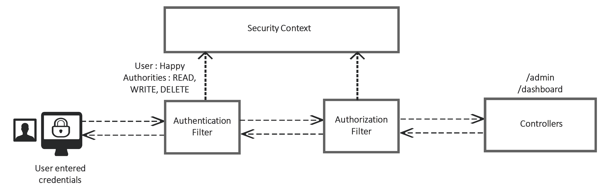

    1. When the Client makes a request with the credentials, 
        - the authentication filter will intercept the request and 
        - validate if the person is valid and is he/she the same person whom they are claiming.
    2. Post authentication 
        - the filter stores the **<u>UserDetails</u>** in the SecurityContext. 
            - The UserDetails will have his username, authorities etc 
    3. Now the authorization filter will intercept and 
        - decide whether the person has access to the given path based on this authorities stored in the SecurityContext 
    4. If authorized 
        - the request will be forwarded to the applicable controllers

### How authority/role stored in spring security
```java
public interface UserDetails extends Serializable {
	/**
	 * Returns the authorities granted to the user. Cannot return null.
	 */
	Collection<? extends GrantedAuthority> getAuthorities();

    ...
}

public class SecurityCustomer implements UserDetails {
    // a DB model
    private final Customer customer; // a customer has a list of authority

	public SecurityCustomer(Customer customer) {
		this.customer = customer;
	}

	@Override
	public Collection<? extends GrantedAuthority> getAuthorities() {
		List<GrantedAuthority> authorities = new ArrayList<>();
		authorities.add(new SimpleGrantedAuthority(customer.getRole()));
		return authorities;
	}

	@Override
	public String getPassword() {
		return customer.getPwd();
	}

	@Override
	public String getUsername() {
		return customer.getEmail();
	}

	@Override
	public boolean isAccountNonExpired() {
		return true;
	}

	@Override
	public boolean isAccountNonLocked() {
		return true;
	}

	@Override
	public boolean isCredentialsNonExpired() {
		return true;
	}

	@Override
	public boolean isEnabled() {
		return true;
	}
}
```

```java
/**
 * Represents an authority granted to an {@link Authentication} object.
 */
public interface GrantedAuthority extends Serializable {
	/**
     * @return a representation of the granted authority (or null if the
	 * granted authority cannot be expressed as a String with sufficient
	 * precision).
	 */
	String getAuthority();
}

/**
 * Basic concrete implementation of a GrantedAuthority
 *
 * Stores a String representation of an authority granted to the Authentication object.
 */
public final class SimpleGrantedAuthority implements GrantedAuthority {
    private final String role;

	public SimpleGrantedAuthority(String role) {
		Assert.hasText(role, "A granted authority textual representation is required");
		this.role = role;
	}

	@Override
	public String getAuthority() {
		return role;
	}

    ...
}
```

### authority v.s. role
|authority|role|
|---|---|
|like an individual privilege|is a group of privileges
|Restricting access in a fine grained manner|Restricting access in a coarse grained manner
|Ex: READ, UPDATE, DELETE|Ex: ROLE_ADMIN, ROLE_USER

### configure authorization by authority in spring security
```java
@Configuration
public class ProjectSecurityConfig extends WebSecurityConfigurerAdapter {
    @Override
	protected void configure(HttpSecurity http) throws Exception {

		http.cors().configurationSource(new CorsConfigurationSource() {
			@Override
			public CorsConfiguration getCorsConfiguration(HttpServletRequest request) {
				CorsConfiguration config = new CorsConfiguration();
				config.setAllowedOrigins(Collections.singletonList("http://localhost:4200"));
				config.setAllowedMethods(Collections.singletonList("*"));
				config.setAllowCredentials(true);
				config.setAllowedHeaders(Collections.singletonList("*"));
				config.setMaxAge(3600L);
				return config;
			}
		}).and().csrf().ignoringAntMatchers("/contact").csrfTokenRepository(CookieCsrfTokenRepository.withHttpOnlyFalse())
				.and().authorizeRequests()
				.antMatchers("/myAccount").hasAuthority("WRITE")
				.antMatchers("/myBalance").hasAuthority("READ")
				.antMatchers("/myLoans").hasAuthority("DELETE")
				.antMatchers("/myCards").authenticated() // user who has authenticated without considering any roles
				.antMatchers("/user").authenticated()
				.antMatchers("/notices").permitAll()
				.antMatchers("/contact").permitAll().and().httpBasic();
	}

    ...
}
```
|||
|---|---|
|hasAuthority()|Accepts a single authority for which the endpoint will be configured and user will be validated against the single authority mentioned. Only users having the same authority configured can call the endpoint.
|hasAnyAuthority()|Accepts multiple authorities for which the endpoint will be configured and user will be validated against the authorities mentioned. Only users having any of the authority configured can call the endpoint.
|access()|Using Spring Expression Language (SpEL) it provides you unlimited possibilities for configuring authorities which are not possible with the above methods. We can use operators like OR, AND inside access() method.

### configure authorization by role in spring security
```java
@Configuration
public class ProjectSecurityConfig extends WebSecurityConfigurerAdapter {
    @Override
	protected void configure(HttpSecurity http) throws Exception {

		http.cors().configurationSource(new CorsConfigurationSource() {
			@Override
			public CorsConfiguration getCorsConfiguration(HttpServletRequest request) {
				CorsConfiguration config = new CorsConfiguration();
				config.setAllowedOrigins(Collections.singletonList("http://localhost:4200"));
				config.setAllowedMethods(Collections.singletonList("*"));
				config.setAllowCredentials(true);
				config.setAllowedHeaders(Collections.singletonList("*"));
				config.setMaxAge(3600L);
				return config;
			}
		}).and().csrf().ignoringAntMatchers("/contact").csrfTokenRepository(CookieCsrfTokenRepository.withHttpOnlyFalse())
				.and().authorizeRequests()
				.antMatchers("/myAccount").hasRole("USER")
				.antMatchers("/myBalance").hasAnyRole("USER","ADMIN")
				.antMatchers("/myLoans").hasRole("ROOT")
				.antMatchers("/myCards").authenticated() // user who has authenticated without considering any roles
				.antMatchers("/user").authenticated()
				.antMatchers("/notices").permitAll()
				.antMatchers("/contact").permitAll().and().httpBasic();
	}
```

|||
|---|---|
|hasRole()| Accepts a single role name for which the endpoint will be configured and user will be validated against the single role mentioned. Only users having the same role configured can call the endpoint.
|hasAnyRole()|Accepts multiple roles for which the endpoint will be configured and user will be validated against the roles mentioned. Only users having any of the role configured can call the endpoint.
|access()| Using Spring Expression Language (SpEL) it provides you unlimited possibilities for configuring roles which are not possible with the above methods. We can use operators like OR, AND inside access() method.

> Note: role in spring are automatically concatnated prefix with "ROLE_" + myRoleString to distinguish role between authority because both of them are using GrantedAuthority in Spring Security.


### matcher in spring
- http.authorizeRequests()

1) .mvcMatchers([optional] HttpMethod.GET, patternString) uses Spring MVC's HandlerMappingIntrospector to match the path and extract variables.

2) .antMatchers([optional] HttpMethod.GET, patternString) is an implementation for Ant-style path patterns. Part of this mapping code has been kindly borrowed from Apache Ant.

3) .regexMatchers([optional] HttpMethod.GET, ".*/en|es|zh") can be used to represent any format of a string, so they offer unlimited possibilities for configuring endpoints security.

> Note : Generally mvcMatcher is more secure than an antMatcher . As an example
<br/>antMatchers("/secured") matches : /secured
<br/>mvcMatchers("/secured") matches : /secured as well as /secured/, /secured.html, /secured.xyz

## section 08: filters in Spring Security
- A filter is a component which receives requests, process its logic and handover to the next filter in the chain.
- Spring Security is based on a chain of servlet filters. 
    - Each filter has a specific responsibility and depending on the configuration, filters are added or removed. We can add our custom filters as well based on the need.
### Enable filter debug mode
1. @EnableWebSecurity(debug = true) on the SpringApplication class. 
    - We need to enable the debugging of the security details
2. Enable logging of the details by adding the below property in `application.properties`
    - logging.level.org.springframework.security.web.FilterChainProxy=DEBUG

### default filter chain for spring security authentication flow
- 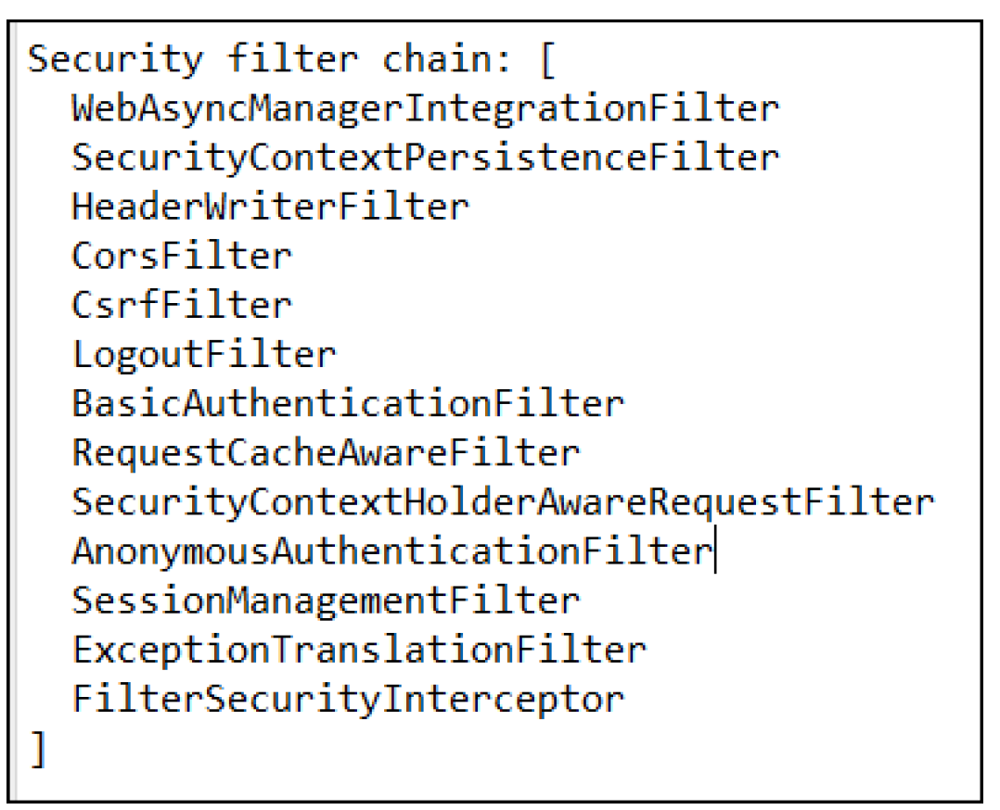

### customized filter
```java
public interface Filter {
    ...

    public void doFilter(ServletRequest request, 
                         ServletResponse response,
                         FilterChain chain) throws IOException, ServletException;

    ...
}
```

|doFilter() parameters||
|---|---|
|ServletRequest|represents the HTTP request. We use the ServletRequest object to retrieve details about the request from the client.
|ServletResponse|represents the HTTP response. We use the ServletResponse object to modify the response before sending it back to the client or further along the filter chain.
|FilterChain|The filter chain represents a collection of filters with a defined order in which they act. We use the FilterChain object to forward the request to the next filter in the chain.

### configure the filter order in the filter chain


- addFilterBefore (filter, class) adds a filter before the position of the specified filter class
- addFilterAfter (filter, class) adds a filter after the position of the specified filter class
- addFilterAt (filter, class) adds a filter at the location of the specified filter class
    - But the order of the execution can’t be guaranteed. This will not replace the filters already present at the same order. Since we will not have control on the order of the filters and it is random in nature we should avoid providing the filters at same order.
    - 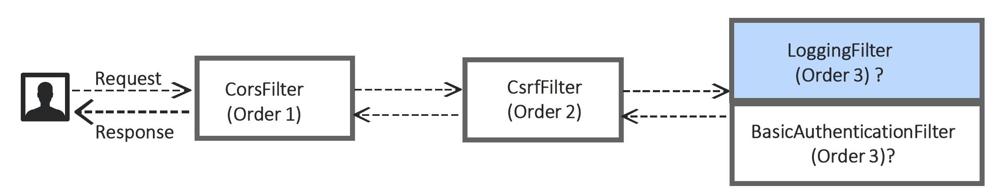

### other builtin filter
```java
public abstract class GenericFilterBean implements Filter, BeanNameAware, EnvironmentAware,
		EnvironmentCapable, ServletContextAware, InitializingBean, DisposableBean {
    ...
}
```
- This is an abstract class filter bean which allows you to use the initialization parameters and configurations done inside the web.xml

```java
public abstract class OncePerRequestFilter extends GenericFilterBean {
    ...

    /**
	 * Same contract as for {@code doFilter}, but guaranteed to be
	 * just invoked once per request within a single request thread.
	 * See {@link #shouldNotFilterAsyncDispatch()} for details.
	 */
	protected abstract void doFilterInternal(
			HttpServletRequest request, HttpServletResponse response, FilterChain filterChain)
			throws ServletException, IOException;
    
    ...
}
```
- Spring doesn't guarantee that your filter will be called only once.But if we have a scenario where we need to make sure to execute our filter only once then we can use this.

For example:
```java
/**
 * A {@link Filter} that performs authentication of a particular request. An
 * outline of the logic:
 *
 * 1. A request comes in and if it does not match {@link #setRequestMatcher(RequestMatcher)}, then this filter does nothing and the {@link FilterChain} is continued. 
 *      If it does match then...
 * 2. An attempt to convert the {@link HttpServletRequest} into an {@link Authentication} is made. If the result is empty, then the filter does nothing more and the {@link FilterChain} is continued. 
 *      If it does create an {@link Authentication}...
 * 3. The {@link AuthenticationManager} specified in {@link #GenericAuthenticationFilter(AuthenticationManager)} is used to perform authentication.
 * 4. The {@link AuthenticationManagerResolver} specified in {@link #GenericAuthenticationFilter(AuthenticationManagerResolver)} is used to resolve the appropriate authentication manager from context to perform authentication.
 * 5. If authentication is successful, {@link AuthenticationSuccessHandler} is invoked and the authentication is set on {@link SecurityContextHolder}, else {@link AuthenticationFailureHandler} is invoked
 */
public class AuthenticationFilter extends OncePerRequestFilter {
    ...

    @Override
	protected void doFilterInternal(HttpServletRequest request, HttpServletResponse response, FilterChain filterChain)
			throws ServletException, IOException {
        // 1.
		if (!this.requestMatcher.matches(request)) {
			filterChain.doFilter(request, response);
			return;
		}

		try {
            // 2.
            // 3. is performed inside `attemptAuthentication(request, response);`
            // 4.
			Authentication authenticationResult = attemptAuthentication(request, response);
			if (authenticationResult == null) {
				filterChain.doFilter(request, response);
				return;
			}

			HttpSession session = request.getSession(false);
			if (session != null) {
				request.changeSessionId();
			}

            // 5.
			successfulAuthentication(request, response, filterChain, authenticationResult);
		} catch (AuthenticationException e) {
			unsuccessfulAuthentication(request, response, e);
		}
	}

    private Authentication attemptAuthentication(HttpServletRequest request, HttpServletResponse response)
			throws AuthenticationException, ServletException {
        // 2. 
		Authentication authentication = this.authenticationConverter.convert(request);
		if (authentication == null) {
			return null;
		}

        // 4.
		AuthenticationManager authenticationManager = this.authenticationManagerResolver.resolve(request);
        // 3.
		Authentication authenticationResult = authenticationManager.authenticate(authentication);
		if (authenticationResult == null) {
			throw new ServletException("AuthenticationManager should not return null Authentication object.");
		}

		return authenticationResult;
	}

    ...
}
```

## section 09: Token based authentication using JSON Web Token (JWT)
### Advantages of Token based Authentication
- Token helps us not to share the credentials for every request which is a security risk to make credentials send over
the network frequently.
- Tokens can be invalidated during any suspicious activities without invalidating the user credentials.
- Tokens can be created with a short life span.
- Tokens can be used to store the user related information like roles/authorities etc.
- Reusability We can have many separate servers, running on multiple platforms and domains, reusing the same token for authenticating the user.
- Security Since we are not using cookies, we don’t have to protect against cross site request forgery (CSRF) attacks.
- Stateless, easier to scale. The token contains all the information to identify the user, eliminating the need for the session state. If we use a load balancer, we can pass the user to any server, instead of being bound to the same server we logged in on.

### What is JWT?
- a token implementation which will be in the JSON format and designed to use for the web requests.
- can be used both in the scenarios of Authorization/Authentication along with Information exchange
    - which means you can share certain user related data in the token itself which will reduce the burden of maintaining such details in the sessions on the server side.
        - > only checking jwt token each time received rather than retriving crediential from DB
- A JWT token has 3 parts each separated by a dot(.). Below is a sample JWT token:
    - 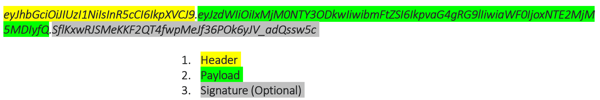
    - 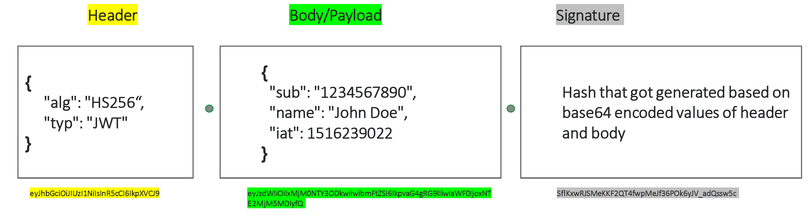
    - signature can be calculated by:
        - HMAC_SHA256(base64UrlEncode(header) + "." + base64UrlEncode(payload), secret)
- [jwt.io](jwt.io): jwt encoding and decoding

### how to configure JWT setup
```java
@Configuration
public class ProjectSecurityConfig extends WebSecurityConfigurerAdapter {
    @Override
	protected void configure(HttpSecurity http) throws Exception {
        // JWT does not require a session
		http.sessionManagement().sessionCreationPolicy(SessionCreationPolicy.STATELESS).and().
		// configure Authorization for CORS
        cors().configurationSource(new CorsConfigurationSource() {
			@Override
			public CorsConfiguration getCorsConfiguration(HttpServletRequest request) {
				CorsConfiguration config = new CorsConfiguration();
				config.setAllowedOrigins(Collections.singletonList("http://localhost:4200"));
				config.setAllowedMethods(Collections.singletonList("*"));
				config.setAllowCredentials(true);
				config.setAllowedHeaders(Collections.singletonList("*"));
				config.setExposedHeaders(Arrays.asList("Authorization"));
				config.setMaxAge(3600L);
				return config;
			}
		}).and().csrf().disable() // disable CSRF because we do not need it
				.addFilterBefore(new RequestValidationBeforeFilter(), BasicAuthenticationFilter.class) // check JWT received is valid
				.addFilterBefore(new JWTTokenValidatorFilter(),       BasicAuthenticationFilter.class) // check signature matches
                    // create UsernamePasswordAuthenticationToken from JWT as Authentication and stored in SecurityContextHolder.getContext()
				.addFilterAt(    new AuthoritiesLoggingAtFilter(),    BasicAuthenticationFilter.class) // log: Authentication Validation is in progress
				.addFilterAfter( new JWTTokenGeneratorFilter(),       BasicAuthenticationFilter.class) // generate JWT if first time visited
				.addFilterAfter( new AuthoritiesLoggingAfterFilter(), BasicAuthenticationFilter.class) // log: successful authentication + authorization roles
				.authorizeRequests()
				.antMatchers("/myAccount").hasRole("USER")
				.antMatchers("/myBalance").hasAnyRole("USER","ADMIN")
				.antMatchers("/myLoans").hasRole("ROOT")
				.antMatchers("/myCards").hasAnyRole("USER","ADMIN")
				.antMatchers("/user").authenticated()
				.antMatchers("/notices").permitAll()
				.antMatchers("/contact").permitAll().and().httpBasic();
	}

    ...
}
```

## section 10: method level security
### why do we need it?
apply the authorization rules at any layer of an application like in service layer or repository layer etc.
### how to configure it?
```java
@Configuration
@EnableGlobalMethodSecurity(prePostEnabled = true,securedEnabled = true,  jsr250Enabled = true)
public class ProjectSecurityConfig extends WebSecurityConfigurerAdapter {
}
```
|||
|---|---|
|prePostEnabled|enables Spring Security @PreAuthorize & @PostAuthorize annotations
|securedEnabled|enables @Secured annotation
|jsr250Enabled|enables @RoleAllowed annotation
- @Secured and @RoleAllowed are less powerful compared to @PreAuthorize and @PostAuthorize

### Invocation authorization
- Validates if someone can invoke a method or not based on their roles/authorities.
#### how to use
```java
@Service
public class LoanService {
    @PreAuthorize("hasAuthority('admin')");
    @PreAuthorize("hasRole('admin')");
    @PreAuthorize("hasAnyRole('admin')");
    @PreAuthorize("# username == authentication.principal.username");
    @PreAuthorize("hasPermission(returnObject, 'admin')");
    public Loan getLoanDetails(String username) {
        return loanRepository.loadLoanByUserName(username);
    }

@Service
public class LoanService {
    @PostAuthorize("returnObject.username == authentication.principal.username");
    @PostAuthorize("hasPermission(returnObject, 'admin')");
    public Loan getLoanDetails(String username) {
        return loanRepository.loadLoanByUserName(username);
    }
```

> When implementing complex authorization logic, we can separate the logic using a separate class that implements `PermissionEvaluator` and overwrite the method `hasPermission()` inside it which can be leveraged inside the hasPermission configurations.
### Filtering authorization
- Validates what a method can receive through its parameters and what the invoker can receive back from the method post business logic execution.
#### when to use
- If we have a scenario where we don’t want to control the invocation of the method `but` we want to make sure that the parameters sent and received to/from the method need to follow authorization rules,
    - then we can consider filtering.
#### how to use
```java
@Service
public class LoanService {
    @PreFilter("filterObject.username == authentication.principal.username")
    public Loan updateLoanDetails(Loan loan) {
        // business logic
        return loan;
    }
}

@Service
public class LoanService {
    @PostFilter("filterObject.username == authentication.principal.username")
    public Loan getLoanDetails() {
        // business logic
        return loans;
    }
}
```
> We can use the @PostFilter on the Spring Data repository methods as well to filter any unwanted data coming from the database.


## section 11: oauth 2.0
### why need it?
1. client do not need to send crediential each time. and authentication logic does not need to be extended each time for each request
2. authentication and authorization logic can be maintained in different place
### oauth 2.0 components
|||
|---|---|
|The Resource Server|where the protected resources owned by user (e.g.: photos, personal information, transactions etc.)
|The user (aka resource owner)|The person who owns resources exposed by the resource server.<br/>- Usually the user will prove his identity with the help of username and password.
|The client|The application that want to access the resources owned by the user on their behalf.<br/>- The client uses a client id and secret to identify itself (different from credentials).
|The authorization server|The server that authorizes the client to access the user resources in the resource server.<br/>- When the authorization server identifies that a client is authorized to access a resource on behalf of the user, it issues a token. The client application uses this token to prove to the resource server that it was authorized by the authorization server. The resource server allows the client to access the resource it requested if it has a valid token after validating the same with Auth server.

### oauth 2.0 flow
#### Authorization code grant type
- 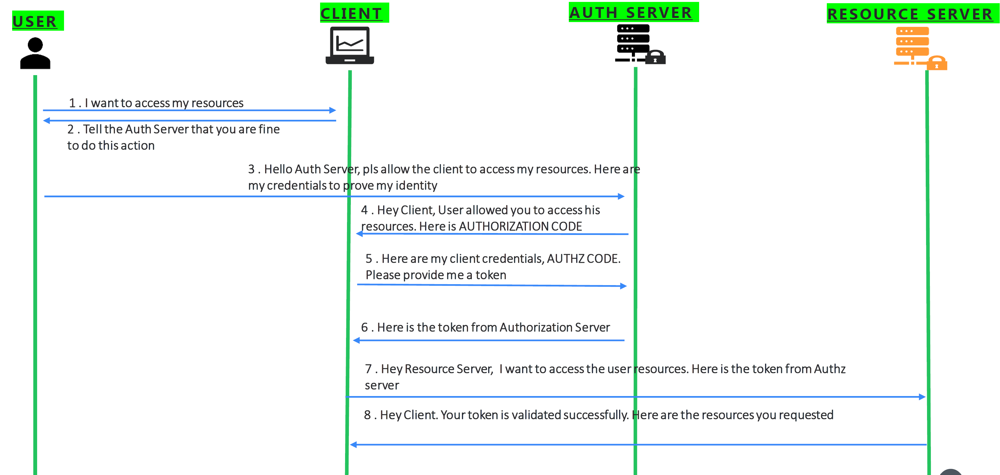
- step 3: sending below
    |||
    |---|---|
    |client_id|the id which identifies the client application by the Auth Server. <br/>- This will be granted when the client register first time with the Auth server.
    |redirect_uri|the URI value which the Auth server needs to redirect post successful authentication. <br/>- If a default value is provided during the registration then this value is optional
    |scope|similar to authorities. Specifies level of access that client is requesting like READ
    |state|CSRF token value to protect from CSRF attacks
    |response_type|With the value ‘**<u>code</u>**’ which indicates that we want to follow authorization code grant type
- step 5: sending for the token in response
    |||
    |---|---|
    |code|the authorization code received from the above steps
    |client_id & client_secret|the client credentials which are registered with the auth server. Please note that these are not user credentials (username + pwd)
    |grant_type|With the value ‘**<u>authorization_code</u>**’ which identifies the kind of grant type is used
    |redirect_uri
> Why not combine step 3 & 5 in one step?<br/>- will make it less secure
#### Implicit grant type
- 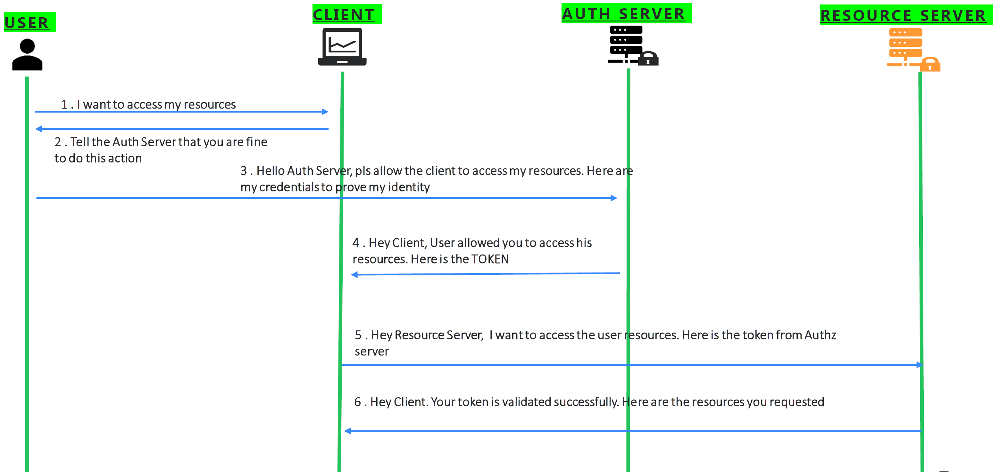
- step 3: sending below
    |||
    |---|---|
    |client_id|the id which identifies the client application by the Auth Server. <br/>- This will be granted when the client register first time with the Auth server.
    |redirect_uri|the URI value which the Auth server needs to redirect post successful authentication. <br/>- If a default value is provided during the registration then this value is optional
    |scope|similar to authorities. Specifies level of access that client is requesting like READ
    |state|CSRF token value to protect from CSRF attacks
    |response_type|With the value ‘**<u>token</u>**’ which indicates that we want to follow implicit grant type

> If the user approves the request, the authorization server will redirect the browser back to the redirect_uri specified by the application, adding a token and state to the fragment part of the URL. For example, the user will be redirected back to a URL such as
<br/>https://example-app.com/redirect#access_token=xMjM0NTY3ODkwIiwibmFtZSI6IkpvaG4gRG9lIiwiY&token_type=Bearer&expires_in=600&state=80bvIn4pUfdSxr6UTjtay8Yzg9ZiAkCzKNwy

#### Resource owner credientials grant type
- 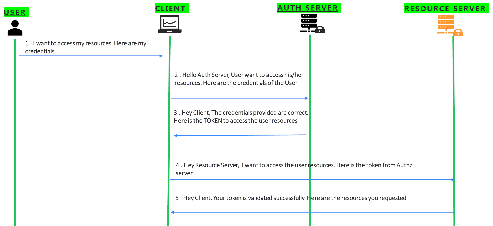
- step 2: sending below
    |||
    |---|---|
    |client_id & client_secret|the credentials of the client to authenticate itself.
    |scope|similar to authorities. Specifies level of access that client is requesting like READ
    |username & password|Credentials provided by the user in the login flow
    |grant_type|With the value ‘**<u>password</u>**’ which indicates that we want to follow password grant type
> • We use this authentication flow only if the <u>client, authorization server and resource servers are maintained by the same organization</u>.<br/>
• This flow will be usually followed by the enterprise applications who want to separate the Auth flow and business flow. Once the Auth flow is separated different applications in the same organization can leverage it. <br/>
• We can’t use the Authorization code grant type since it won’t look nice for the user to redirect multiple pages inside your organization for authentication.

#### Client credientials grant type
- 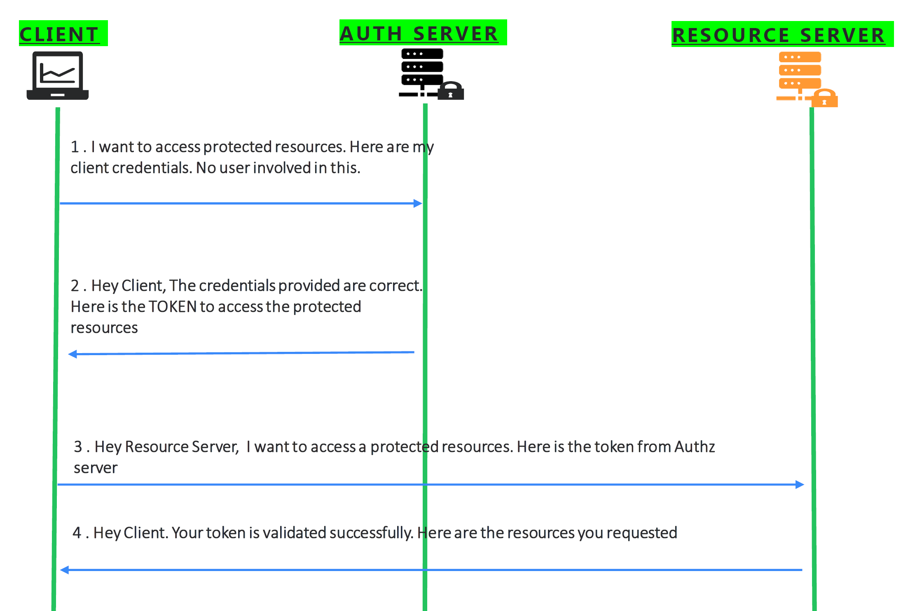
- step 1: sending below
    |||
    |---|---|
    |client_id & client_secret|the credentials of the client to authenticate itself.
    |scope|similar to authorities. Specifies level of access that client is requesting like READ
    |grant_type|With the value ‘**<u>client_credentials</u>**’ which indicates that we want to follow client credentials grant type
> We use this authentication flow only if <u>there is no user and UI involved</u>. Like in the scenarios where 2 different applications want to share data between them using backend APIs.

#### Refresh token grant type
- 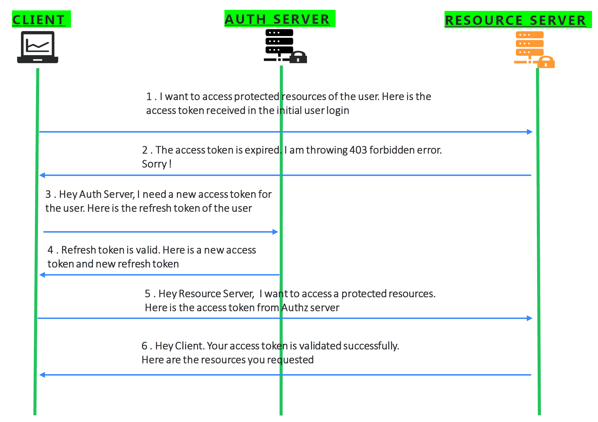
- step 3: sending below
    |||
    |---|---|
    |client_id & client_secret|the credentials of the client to authenticate itself.
    |refresh_token|the value of the refresh token received initially
    |scope|similar to authorities. Specifies level of access that client is requesting like READ
    |grant_type|With the value ‘**<u>refresh_token</u>**’ which indicates that we want to follow refresh token grant type

> This flow will be used in the scenarios where the access token of the user is expired. Instead of asking the user to login again and again, we can use the refresh token which originally provided by the Authz server to reauthenticate the user.

### How does resource server validate received token?
- 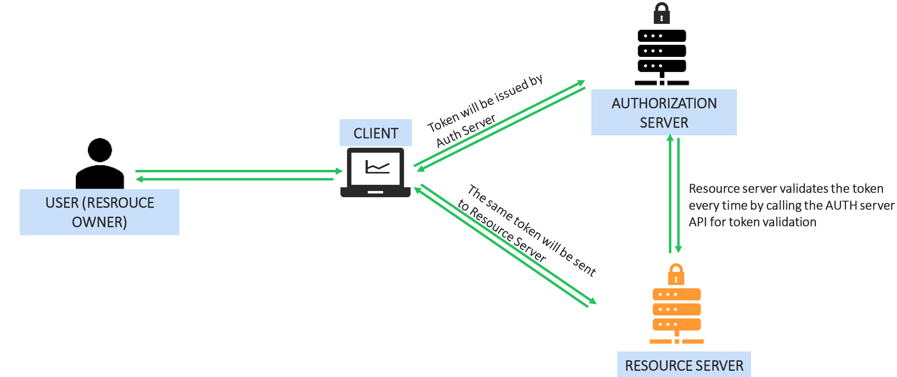
- 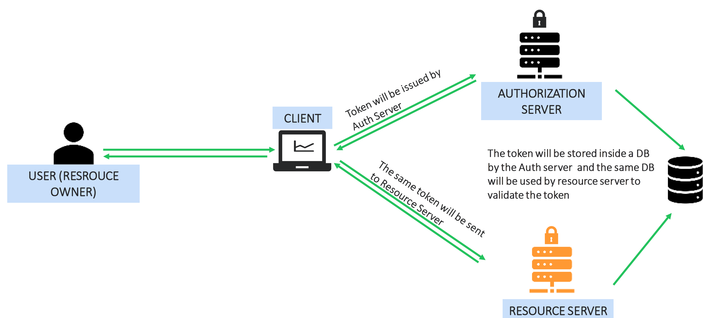
- 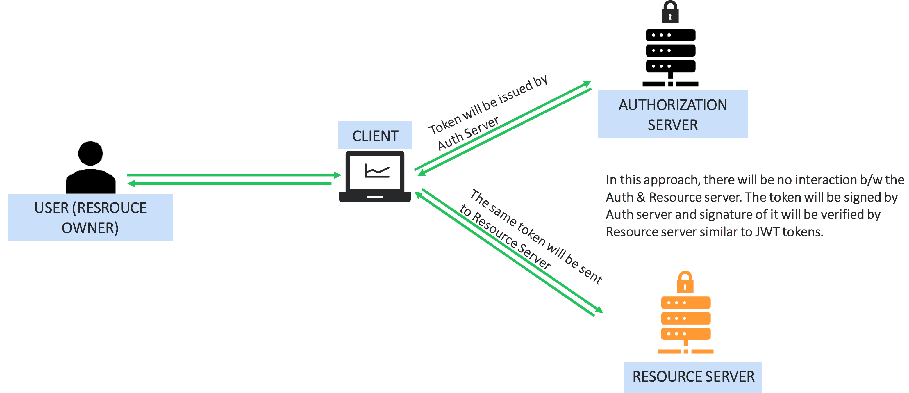


